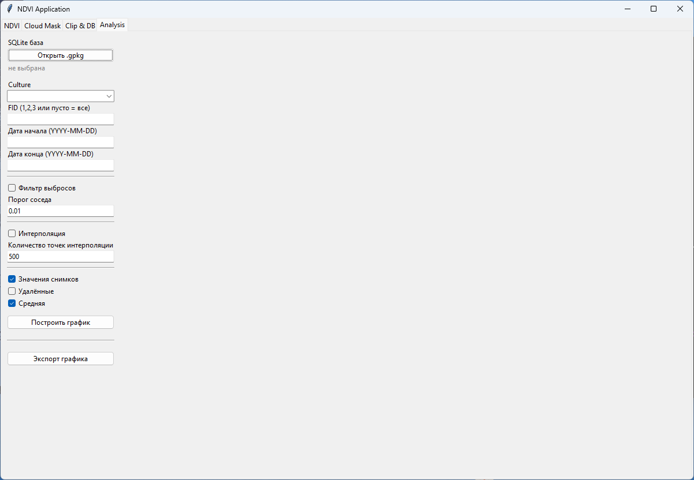
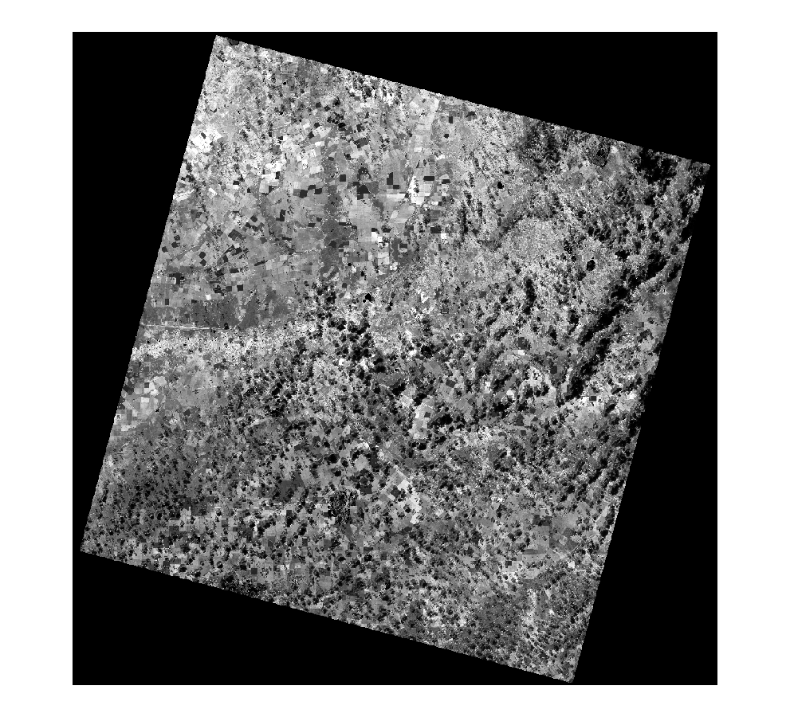
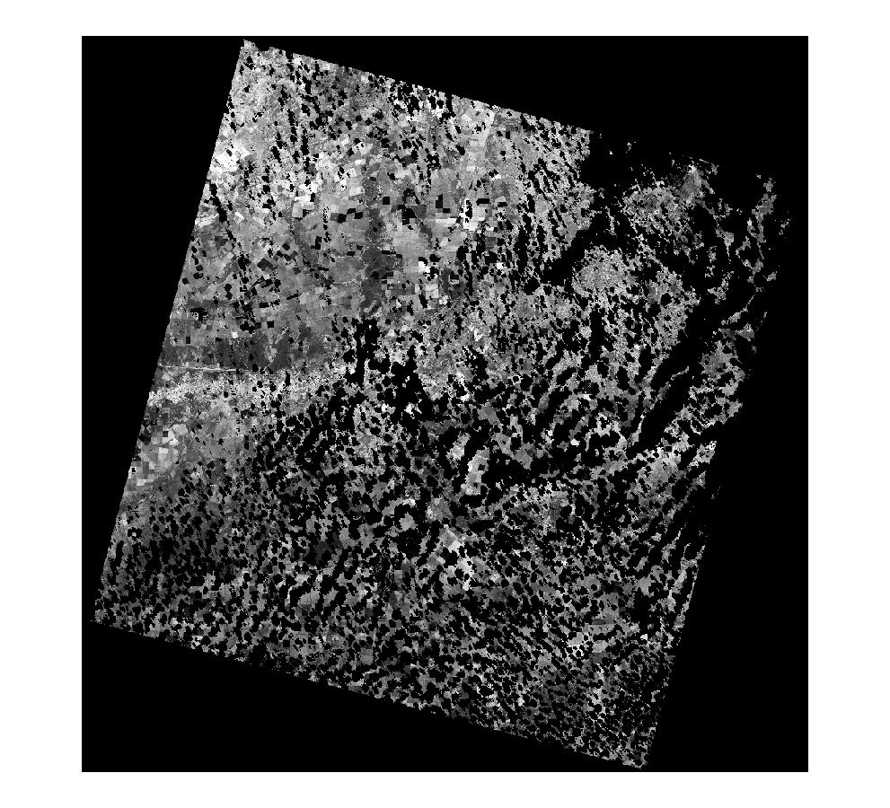
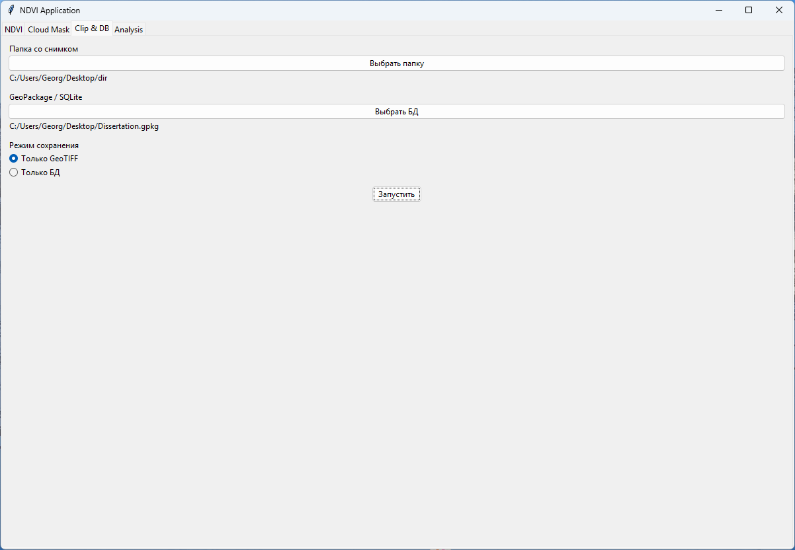
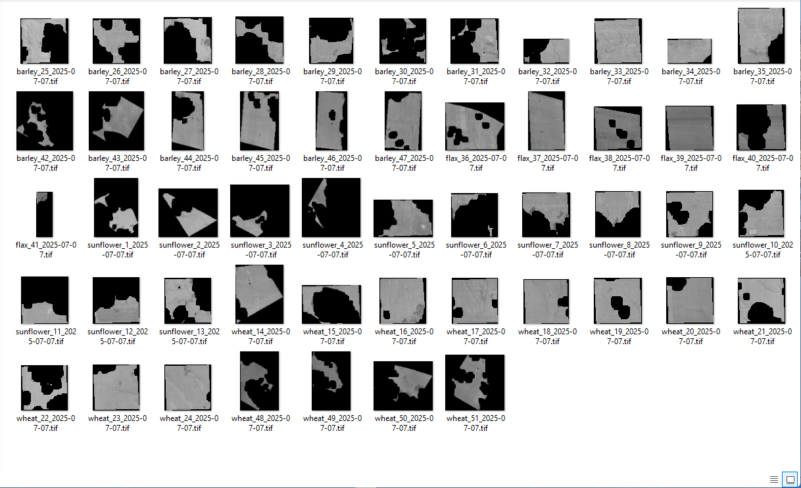
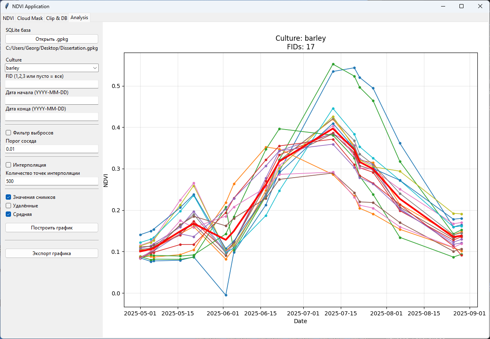
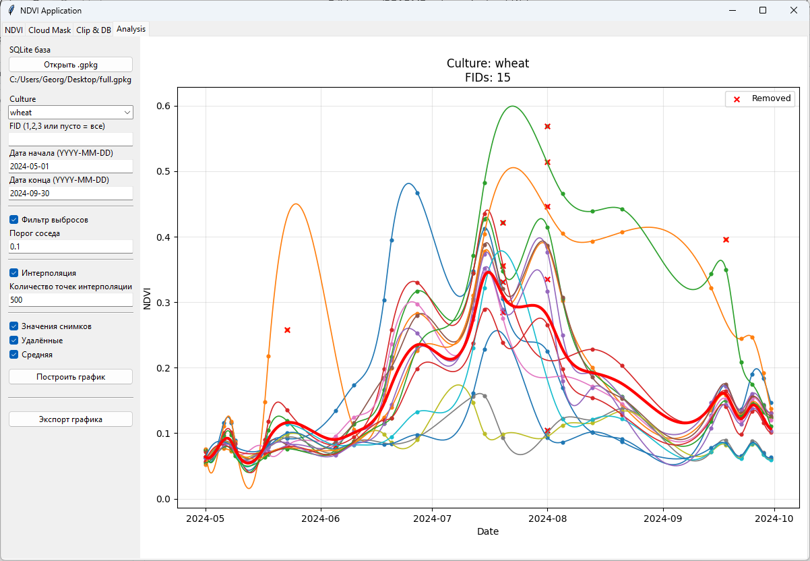

#  NDVI Time Series. Processing & Visualization Toolkit

Набор инструментов для обработки, агрегации и визуализации временных рядов **NDVI**, полученных из растровых спутниковых данных, с сохранением результатов в базу данных и последующим анализом.

Проект ориентирован на анализ сельскохозяйственных культур и временных рядов NDVI по отдельным полигонам (FID).

В проекте реализовано взаимодействие с снимками Landsat и Sentinel, как показательный вариант работы с растровыми изображениями.  

---

##  Возможности

-  Итерация по обрезанным NDVI-растрам
-  Маскирование `nodata` и вычисление среднего NDVI
-  Запись результатов в базу данных (GeoPackage / SQLite)
-  Фильтрация выбросов по соседним значениям
-  Сглаживание временных рядов (B-spline)
-  Построение графиков:
    - отдельных NDVI-кривых
    - средней кривой по группе полей
    - удалённых выбросов
-  Экспорт графиков в файл (PNG, PDF и др.)

---

##  Структура проекта

```text
nts/
├── __init__.py          
├── calc.py                    # Вычисление растров
  ├── NDVICalculator             # Вычисление растра на основе RED и NIR каналов Landsat и Sentinel
  ├── CloudMasker                # Вычисление растра на основе RED, NIR и маски облаков Landsat и Sentinel
  ├── ClippedNdarrayIterator     # Итератор по массивам обрезанных растров (yield ndarray, meta, fid, culture)
├── DB.py                      # Работа с базой данных
  ├── DataBaseReader             # Класс методы которого используются в основном для чтения базы данных
  ├── DataBaseWriter             # Класс методы которого используются в основном для записи в базу данных
├── anlysis.py                 # Анализ данных
  ├── CSVExporterAll             # Класс для экспорта записей из базы данных в CSV-файл (fid,date,culture,ndvi)
  ├── CSVExporter                # Класс для экспорта с группировкой по датам и культурам (culture_fid,culture_date,culture_ndvi)
  ├── NDVIPlotter                # Класс для анализа, обработки и визуализации временных рядов NDVI
├── main.py                    # Вспомогательные классы
├── GIU.py                     # Графический интерфейс
```
---

## Примеры использования
Установка зависимостей:
```
pip install -r requirements.txt 
```
Инициализвция GUI:
```
from nts.GUI import NDVIApp

NDVIApp().mainlopp()
```
Вывод:
<p align="center">

</p>

Разделы **NDVI** и **Cloud Mask** в основном используют возможности *Rasterio* с некотрыми исправлениями проекции и трансформации масок облаков:
```
from nts.calc import NDVICalculator
import rasterio

ndvi = NDVICalculator(path_dir)
with rasterio.open("output_path", "w", **ndvi.profile) as dst:
    dst.write(ndvi.ndarray)
```
Вывод:
<p align="center">

</p>

С **CloudMasker** проиходит тоже самое только еще применятеся маска облаков QA_PIXEL для Landsat и SCL для Sentinel.

```
from nts.calc import ClaudMasker
import rasterio

ndvi = ClaudMasker(path_dir)
with rasterio.open("output_path", "w", **ndvi.profile) as dst:
    dst.write(ndvi.ndarray)
```
Вывод:
<p align="center">

</p>

Директория должна быть вида:
```
dir/
├── LC08_L2SP_156024_20250707_20250715_02_T1_SR_B4.tif        # RED
├── LC08_L2SP_156024_20250707_20250715_02_T1_SR_B5.tif        # NIR
├── LC08_L2SP_156024_20250707_20250715_02_T1_QA_PIXEL.tif     # Маска облаков
# Пример для Landsat 8

dir/
├── T42UXB_20250712T061651_B04_10m.tif                        # RED
├── T42UXB_20250712T061651_B08_10m.tif                        # NIR
├── T42UXB_20250712T061651_SCL_20m.tif                        # Маска облаков
# Пример для Sentinel
```
Окно **Clip & DB** может быть использовано для сохранения обрезанных маскированных растров или записи среднего NDVI по каждому обрезанному растру в базу данных.  
База данных GeoPackage должна содержать таблицу с названием по умолчанию ***"fields"***, с полями *"fid"* и *"culture"* и, создаваемую например QGIS по умолчанию, полем *"geom"* для геометрий полигонов.  
Новая таблица с результатами создается в том же GeoPackage с названием по умолчанию ***"results"*** и содержит поля *"id"* - просто индексация каждого значения, может быть полезно при работа с SQL, *"fid"* - берется из таблицы ***"fields"***, *"date"* - берется из названия файла (метод *get_date* из класса **NDVICalculator**), *"culture"* -  берется из таблицы ***"fields"*** и *"ndvi"* - вычисляется из массива *ndarray* методом *mean* из *numpy*.

<p align="center">

</p>

```
from nts.calc import ClippedNdarrayIterator
import rasterio
import os

iterator = ClippedNdarrayIterator(path_dir, gpkg_path)
date = iterator.get_date()

for ndarray, meta, fid, culture in iterator:
    path = os.path.join(out_dir, f"{culture}_{fid}_{date}.tif")
    with rasterio.open(path, "w", **meta) as dst:
        dst.write(ndarray)
```

Вывод:
<p align="center">

</p>

Только для записи используется класс **Main** из *main.py*.

```
from nts.calc import ClippedNdarrayIterator
from nts.DB import DatabaseWriter
import numpy as np
import os

writer = DatabaseWriter(gpkg_path)
iterator = ClippedNdarrayIterator(path_dir, gpkg_path)

for ndarray, meta, fid, culture in iterator:
    nodata = meta["nodata"]
    masked = np.ma.masked_equal(ndarray, nodata)
    mean_val = masked.mean()

    if hasattr(mean_val, "item"):
        mean_val = mean_val.item()

    if mean_val == 0.0:
        continue

    writer.insert_results_to_db(fid, iterator.get_date(), culture, mean_val)
```

На основе таблицы *"results"* в GeoPackage в окне **Analysis** строятся графики временных рядов NDVI.  
Культура и среднее:

<p align="center">

</p>

Культура за определенный год, фильтрация выбросов, интерполяция, показ удаленных выбросов и средняя:

<p align="center">

</p>

Далее полученный график можно эскопртировать.
